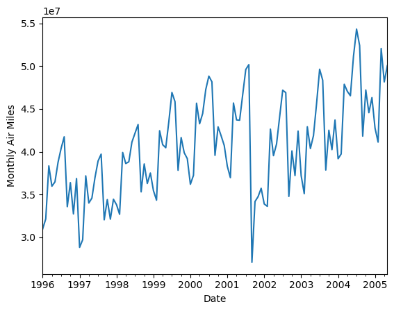
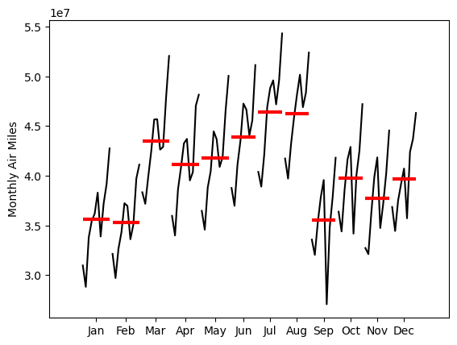
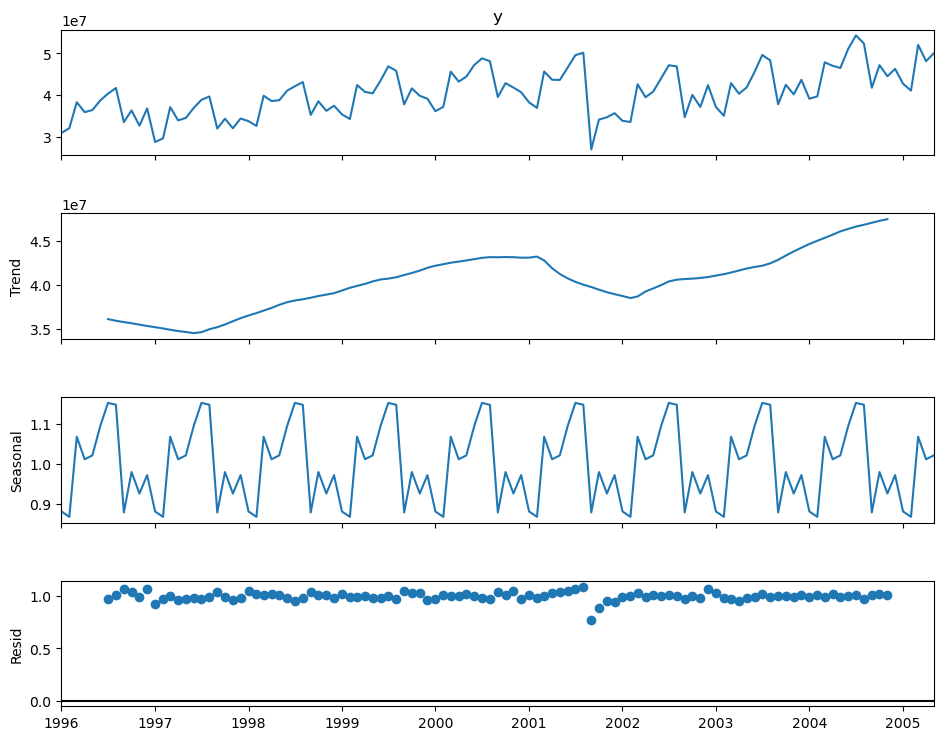
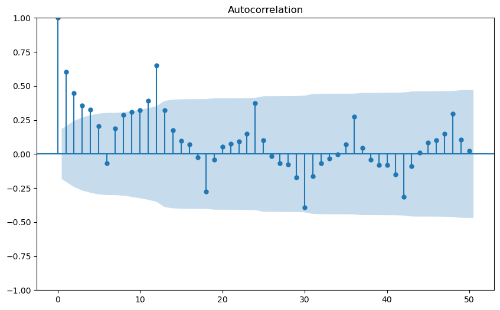
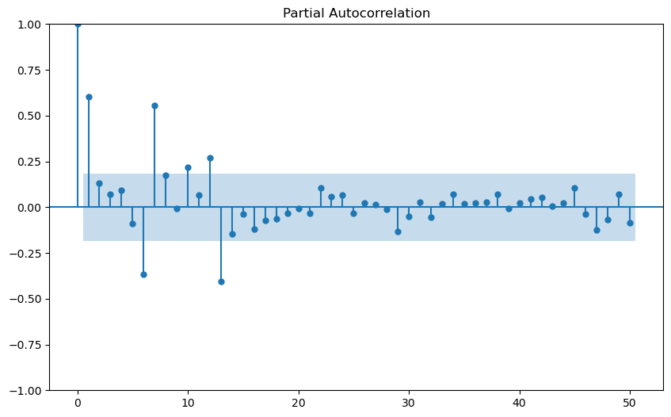
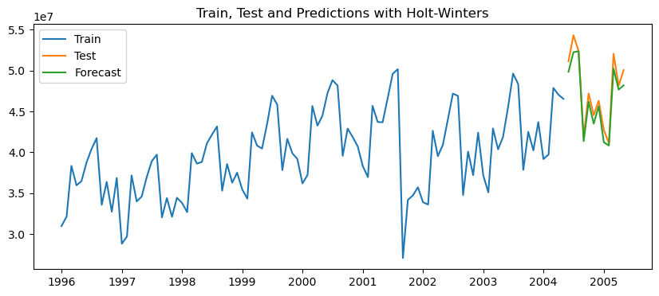
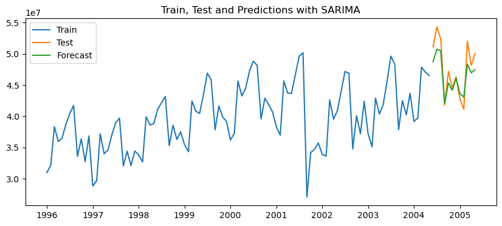
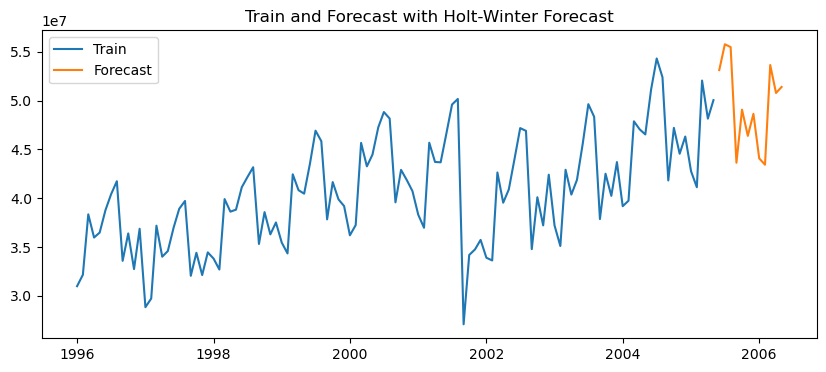

# Time_Series_Analysis

##### 参考代码：

ARIMA, SARIMA and SARIMAX.ipynb

##### 结果解释：

* 数据为 from 1996-01-01 to 2005-05-01 每月第一天的 airmiles 数值，数据随时间分布如图所示。



* 红线为每月均值。观察每个月的数值变化，可以看到数据大小存在周期性变化（不同月份的均值存在显著差异），周期为12个月。



* 对序列进行乘法分解，可以看到整体数值呈现缓慢波动式上升的趋势，并且有一定的季节性周期变化。

  

* 观察序列的自相关系数，可以看到，当前值与前面 1 到 5 期有较强的线性相关性，并且序列显示出季节性周期信号。

  

* 偏自相关系数用于衡量当前时间点与滞后时间点之间的“直接关系”，由图可知，当前值与前一时期（Lag 1）之间有非常强的直接线性关系，并且多个滞后仍有显著偏自相关，说明序列可能存在较高阶的自回归效应。



* 划分12个月作为测试集，用以12个月为周期，三阶指数平滑做时间序列预测，模型表现如下：

  ```
  The MAE is 1046933.53
  The RMSE is 1230641.26
  The MAPE is 2.16 %
  ```

  如图所示，模型表现尚可。

  

* 划分12个月作为测试集，以12个月为周期，用SARIMA做时间序列预测。

  对参数进行网格搜索，得到最小的AIC和BIC组合，此时模型参数为 **SARIMAX(0, 1, 1)x(2, 0, 1, 12)** 。

  模型表现如下：

  ```
  The MAE is 1736087.15
  The RMSE is 2085010.33
  The MAPE is 3.51 %
  ```

  如图所示，模型表现尚可。

  

* 综合考量模型的可靠性和准确性，选择三阶指数平滑预测未来12个月的序列变化情况。

  预测结果如下。需要提到的是，模型训练过程中未能完全收敛到最优值，但由于预测结果与实际观测值误差较小，因此可以使用该模型进行短期预测。

  